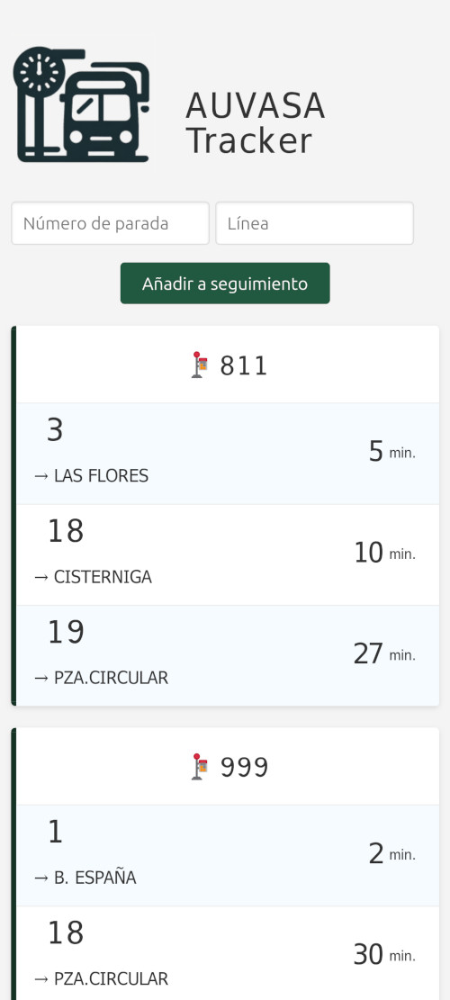

# AUVASA Tracker

Esta aplicación web permite a los usuarios llevar un seguimiento de las líneas de autobús y paradas que les interesan del sistema AUVASA en Valladolid, España.

**[🚍 Acceder a la web e instalar](https://auvasatracker.com/)**

## Funcionalidades

* Agregar paradas y números de línea para hacerles seguimiento.
* Consultar el tiempo programado y real de llegada de las líneas.
* Visualización de retrasos o adelantos frente a la hora programada.
* Mostrar la información agrupada por paradas para facilitar la vista.
* Alertas de servicio en líneas afectadas.
* Seguimiento en el mapa de ubicación de autobuses.
* Eliminar paradas y líneas que el usuario ya no desee seguir.
* Los datos se almacenan en el navegadory persisten entre sesiones.
* Se puede instalar como una aplicación nativa (PWA).

## Tecnologías

* JavaScript.
* HTML/CSS.
* [api-auvasa](https://github.com/DaviidMM/api-auvasa) para obtener datos en tiempo real.
* LocalStorage para almacenamiento en el cliente.
* PWA para la instalación nativa.

## Uso

1. Ingresar número de parada y línea a agregar.
2. La app consultará la API para validar que existan.
3. Se mostrará el tiempo programado y real (si está disponible) de llegada del próximo autobús.
4. Los datos se actualizan cada 30 segundos.

Esta sencilla app permite a los usuarios de AUVASA en Valladolid llevar un seguimeinto de las líneas y paradas de su interés para estar al tanto de los tiempos de llegada de los autobuses en tiempo real.